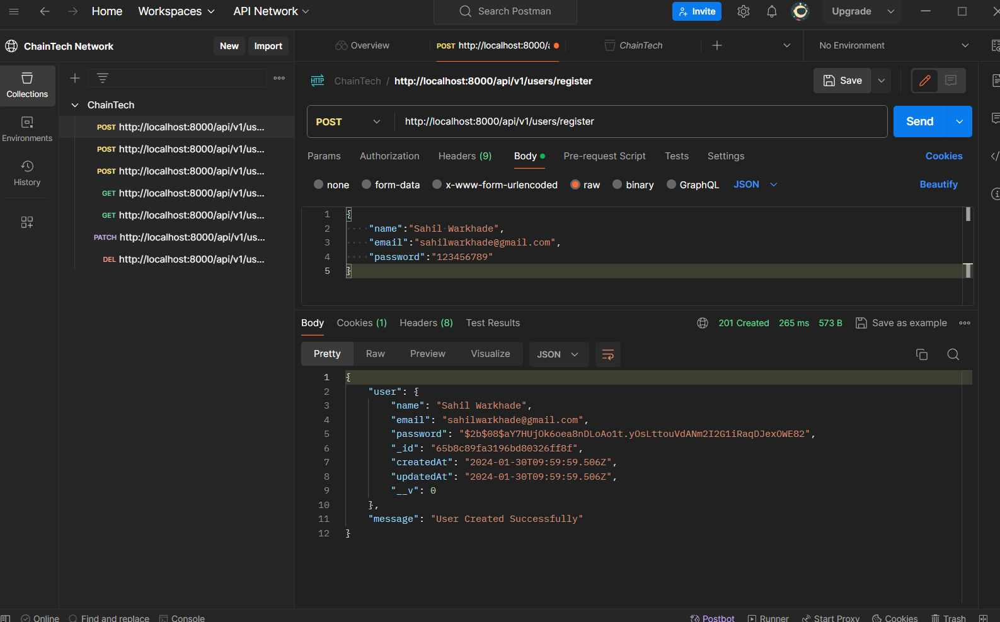

# Task Manager

## Introduction

The Node.js Task Manager Application is a simple and effective tool for managing your tasks and staying organized. This application allows you to easily add, update, and track your tasks, providing a streamlined solution for personal or team productivity.

## Features

- **Task Management:** Add, update, and remove tasks effortlessly.
- **Completion Tracking:** Mark tasks as completed to monitor your progress.

## Installation

To get started with the To-Do List Application, follow these steps:

1. **Clone the Repository:**

    ```bash
       git clone https://github.com/sahilwarkhade/TaskManager-Backend.git
    ```

2. **Go to the code directory:**

    ```bash
       cd TaskManager-Backend
    ```

3. **Install npm modules:**
    ```bash
       npm install
    ```


## Project Structure:
    ```bash
        ├── node_modules
        ├── controllers
        │ ├── Tasks.js
        │ └── user.js
        ├── middlewares
        │ ├── auth.js
        ├── models
        │ |── Task.js
        | └── User.js
        ├── routes
        │ |── taskRoutes.js
        | └── userRoutes.js
        ├── db.js
        ├── index.js
        ├── package.json
    ```

## Code Structure

- `/node_modules`: Folder where npm installs project dependencies.
- `/controllers`: Controllers handling the application logic.
- `/models`: Data models representing the application entities.
- `/middlewares` : Define all middlewares.
- `/routes`: Express.js route definitions.
- `/db.js`: Utility functions to connect Database connection with server.
- `/index.js`: Main entry point of the application.
- `package.json`: Configuration file with project details and dependencies.
- `README.md`: Documentation file.


## Application Structure

### `/controllers`

- **`User.js`**: Controller for user-related operations.
- **`Tasks.js`**: Controller for task-related operations.

### `/middlewares`

- **`auth.js`**: Authentication middleware to authenticate the user.

### `/models`

- **`User.js`**: User data model.
- **`Task.js`**: Task data model.

### `/routes`

- **`userRoutes.js`**: Express.js routes for user-related endpoints.
- **`taskRoutes.js`**: Express.js routes for task-related endpoints.


### `/db`

- **`db.js`**: Establish the connection between database and server.

### `index.js`

- Main entry point of the application where the Express.js server is initialized.


## API Testing Screenshots


       

      

     


<!--  -->
<!-- 


 -->
